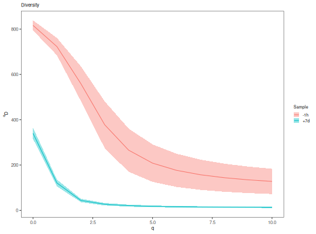
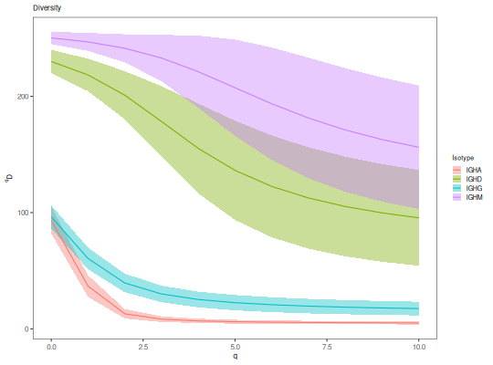

**alphaDiversity** - *Calculate clonal alpha diversity*

Description
--------------------

`alphaDiversity` takes in a data.frame or [AbundanceCurve](AbundanceCurve-class.md) and computes
diversity scores (<code class = 'eq'>D</code>) over an interval of diversity orders (<code class = 'eq'>q</code>).


Usage
--------------------
```
alphaDiversity(data, min_q = 0, max_q = 4, step_q = 0.1, ci = 0.95,
...)
```

Arguments
-------------------

data
:   data.frame with Change-O style columns containing clonal assignments or
a [AbundanceCurve](AbundanceCurve-class.md) generate by [estimateAbundance](estimateAbundance.md) object 
containing a previously calculated bootstrap distributions of clonal abundance.

min_q
:   minimum value of <code class = 'eq'>q</code>.

max_q
:   maximum value of <code class = 'eq'>q</code>.

step_q
:   value by which to increment <code class = 'eq'>q</code>.

ci
:   confidence interval to calculate; the value must be between 0 and 1.

...
:   additional arguments to pass to [estimateAbundance](estimateAbundance.md). Additional arguments
are ignored if a [AbundanceCurve](AbundanceCurve-class.md) is provided as input.


Value
-------------------

A [DiversityCurve](DiversityCurve-class.md) object summarizing the diversity scores.


Details
-------------------

Clonal diversity is calculated using the generalized diversity index (Hill numbers) 
proposed by Hill (Hill, 1973). See [calcDiversity](calcDiversity.md) for further details.

Diversity is calculated on the estimated complete clonal abundance distribution.
This distribution is inferred by using the Chao1 estimator to estimate the number
of seen clones, and applying the relative abundance correction and unseen clone
frequency described in Chao et al, 2015.

To generate a smooth curve, <code class = 'eq'>D</code> is calculated for each value of <code class = 'eq'>q</code> from
`min_q` to `max_q` incremented by `step_q`.  When `uniform=TRUE`
variability in total sequence counts across unique values in the `group` column 
is corrected by repeated resampling from the estimated complete clonal distribution to a 
common number of sequences.

The diversity index (<code class = 'eq'>D</code>) for each group is the mean value of over all resampling 
realizations. Confidence intervals are derived using the standard deviation of the 
resampling realizations, as described in Chao et al, 2015.

Of note, the complete clonal abundance distribution is inferred by using the Chao1 
estimator to estimate the number of seen clones, and then applying the relative abundance 
correction and unseen clone frequencies described in Chao et al, 2015.


References
-------------------


1. Hill M. Diversity and evenness: a unifying notation and its consequences. 
Ecology. 1973 54(2):427-32.
1. Chao A. Nonparametric Estimation of the Number of Classes in a Population. 
Scand J Stat. 1984 11, 265270.
1. Chao A, et al. Rarefaction and extrapolation with Hill numbers: 
A framework for sampling and estimation in species diversity studies. 
Ecol Monogr. 2014 84:45-67.
1. Chao A, et al. Unveiling the species-rank abundance distribution by 
generalizing the Good-Turing sample coverage theory. 
Ecology. 2015 96, 11891201.


Examples
-------------------

```R
# Group by sample identifier in two steps
abund <- estimateAbundance(ExampleDb, group="sample_id", nboot=100)
div <- alphaDiversity(abund, step_q=1, max_q=10)
plotDiversityCurve(div, legend_title="Sample")

```



```R

# Grouping by isotype rather than sample identifier in one step
div <- alphaDiversity(ExampleDb, group="c_call", min_n=40, step_q=1, max_q=10, 
nboot=100)
plotDiversityCurve(div, legend_title="Isotype")
```




See also
-------------------

See [calcDiversity](calcDiversity.md) for the basic calculation and 
[DiversityCurve](DiversityCurve-class.md) for the return object. 
See [plotDiversityCurve](plotDiversityCurve.md) for plotting the return object.


