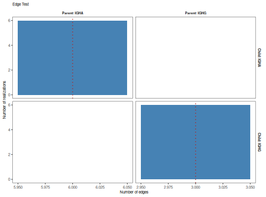
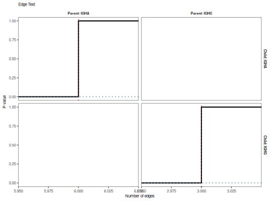

**plotEdgeTest** - *Plot the results of an edge permutation test*

Description
--------------------

`plotEdgeTest` plots the results of an edge permutation test performed with 
`testEdges` as either a histogram or cumulative distribution function.


Usage
--------------------
```
plotEdgeTest(
data,
color = "black",
main_title = "Edge Test",
style = c("histogram", "cdf"),
silent = FALSE,
...
)
```

Arguments
-------------------

data
:   [EdgeTest](EdgeTest-class.md) object returned by [testEdges](testEdges.md).

color
:   color of the histogram or lines.

main_title
:   string specifying the plot title.

style
:   type of plot to draw. One of:

+  `"histogram"`:  histogram of the edge count 
distribution with a red dotted line
denoting the observed value.
+  `"cdf"`:        cumulative distribution function 
of edge counts with a red dotted 
line denoting the observed value and
a blue dotted line indicating the 
p-value.


silent
:   if `TRUE` do not draw the plot and just return the ggplot2 
object; if `FALSE` draw the plot.

...
:   additional arguments to pass to ggplot2::theme.


Value
-------------------

A `ggplot` object defining the plot.


Examples
-------------------

```R
# Define example tree set
graphs <- ExampleTrees[1-10]

# Perform edge test on isotypes
x <- testEdges(graphs, "c_call", nperm=10)

# Plot
plotEdgeTest(x, color="steelblue", style="hist")

```



```R
plotEdgeTest(x, style="cdf")
```




See also
-------------------

See [testEdges](testEdges.md) for performing the test.


