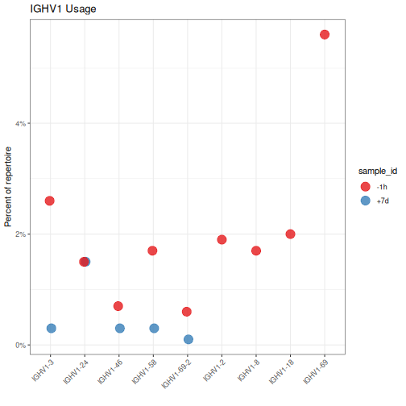
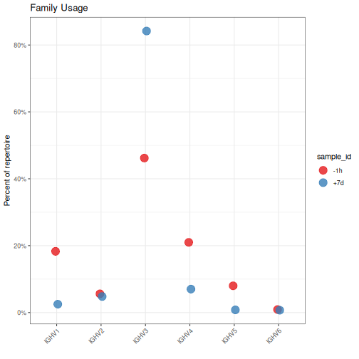
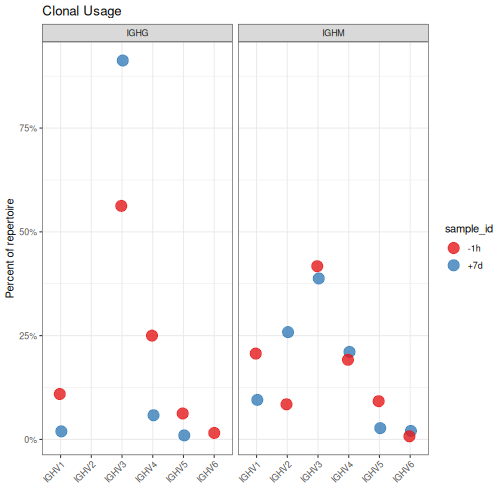
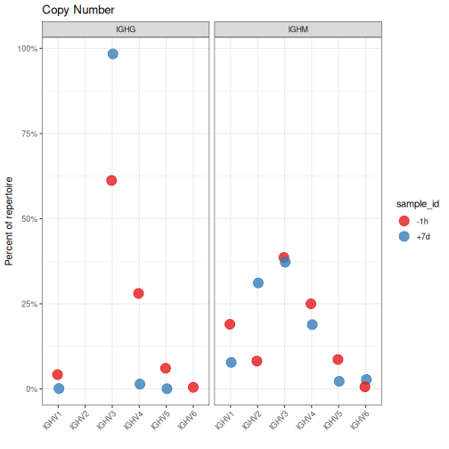

Gene usage analysis
====================


The 'alakazam' package provides basic gene usage quantification by either sequence count 
or clonal grouping; with or without consideration of duplicate reads/mRNA. Additionally, 
a set of accessory functions for sorting and parsing V(D)J gene names 
are also provided.

## Example data

A small example Change-O database, `ExampleDb`, is included in the `alakazam` package. 
Gene usages analysis requires only the following columns:

* `V_CALL`
* `D_CALL`
* `J_CALL`

However, the optional clonal clustering (`CLONE`) and duplicate count (`DUPCOUNT`) 
columns may be used to quanitify usage by different abundance criteria.


```r
# Load required packages
library(alakazam)
library(dplyr)
library(scales)

# Subset example data
data(ExampleDb)
```

## Tabulate V(D)J allele, gene or family usage by sample

The relative abundance of V(D)J alleles, genes or families within groups can be obtained 
with the function `countGenes`. To analyze differences in the V gene usage across 
different samples we will set `gene="V_CALL"` (the column containing gene data) and 
`groups="SAMPLE"` (the columns containing grouping variables). To quanitify abundance at
the gene level we set `mode="gene"`:


```r
# Quantify usage at the gene level
gene <- countGenes(ExampleDb, gene="V_CALL", groups="SAMPLE", 
                   mode="gene")
head(gene, n=4)
```

```
## Source: local data frame [4 x 4]
## Groups: SAMPLE [2]
## 
##   SAMPLE     GENE SEQ_COUNT SEQ_FREQ
##    <chr>    <chr>     <int>    <dbl>
## 1    +7d IGHV3-49       699    0.699
## 2    -1h  IGHV3-9        83    0.083
## 3    -1h IGHV5-51        60    0.060
## 4    -1h IGHV3-30        58    0.058
```

In the resultant `data.frame` the `SEQ_COUNT` columns is the number of raw sequences within each `SAMPLE` 
group for the given `GENE`. `SEQ_FREQ` is the frequency of each `GENE` within the given `SAMPLE`.

Below we plot only the IGHV1 abundance by filtering on the `GENE` column to only rows 
containing IGHV1 family genes. We extract the family portion of the gene name using the 
`getFamily` function. Also, we take advantage of the `sortGenes` function to convert the 
`GENE` column to a factor with gene name lexicographically ordered in the factor levels 
(`method="name"`) for axis ordering using the `ggplot2` package. Alternatively, we could have 
ordered the genes by genomic position by passing `method="position"` to `sortGenes`.


```r
# Assign sorted levels and subset to IGHV1
ighv1 <- gene %>%
    mutate(GENE=factor(GENE, levels=sortGenes(unique(GENE), method="name"))) %>%
    filter(getFamily(GENE) == "IGHV1")

# Plot V gene usage in the IGHV1 family by sample
g1 <- ggplot(ighv1, aes(x=GENE, y=SEQ_FREQ)) +
    theme_bw() +
    ggtitle("IGHV1 Usage") +
    theme(axis.text.x=element_text(angle=45, hjust=1, vjust=1)) +
    ylab("Percent of repertoire") +
    xlab("") +
    scale_y_continuous(labels=percent) +
    scale_color_brewer(palette="Set1") +
    geom_point(aes(color=SAMPLE), size=5, alpha=0.8)
plot(g1)
```


Alternatively, usage can be quantified at the allele (`mode="allele"`) or 
family level (`mode="family"`):


```r
# Quantify V family usage by sample
family <- countGenes(ExampleDb, gene="V_CALL", groups="SAMPLE", 
                     mode="family")

# Plot V family usage by sample
g2 <- ggplot(family, aes(x=GENE, y=SEQ_FREQ)) +
    theme_bw() +
    ggtitle("Family Usage") +
    theme(axis.text.x=element_text(angle=45, hjust=1, vjust=1)) +
    ylab("Percent of repertoire") +
    xlab("") +
    scale_y_continuous(labels=percent) +
    scale_color_brewer(palette="Set1") +
    geom_point(aes(color=SAMPLE), size=5, alpha=0.8)
plot(g2)
```




## Tabulating gene abundance using additional groupings

The `groups` argument to `countGenes` can accept multiple grouping columns and
will calculated abundance within each unique combination. In the examples below
groupings will be perform by unique sample and isotype pairs 
(`groups=c("SAMPLE", "ISOTYPE")`). Furthermore, instead of quantifying abundance
by sequence count we will quantify it by clone count. Meaning, each clone will
be counted only once regardless of how many sequences the clone represents.  
Clonal citeria are adding by passing a value to the `clone` argument of `countGenes`
(`clone="CLONE"`).


```r
# Quantify V family clonal usage by sample and isotype
family <- countGenes(ExampleDb, gene="V_CALL", groups=c("SAMPLE", "ISOTYPE"), 
                     clone="CLONE", mode="family")
head(family, n=4)
```

```
## Source: local data frame [4 x 5]
## Groups: SAMPLE, ISOTYPE [2]
## 
##   SAMPLE ISOTYPE  GENE CLONE_COUNT CLONE_FREQ
##    <chr>   <chr> <chr>       <int>      <dbl>
## 1    -1h     IgM IGHV3         222  0.4172932
## 2    -1h     IgM IGHV1         110  0.2067669
## 3    -1h     IgM IGHV4         102  0.1917293
## 4    +7d     IgG IGHV3          94  0.9126214
```

The output `data.frame` contains the additional grouping column (`ISOTYPE`) along with the 
`CLONE_COUNT` and `CLONE_FREQ` columns that represent the count of clones for each V family 
and the frequencies within the given `SAMPLE` and `ISOTYPE` pair, respectively.


```r
# Subset to IgM and IgG for plotting
family <- filter(family, ISOTYPE %in% c("IgM", "IgG"))
# Plot V family clonal usage by sample and isotype
g3 <- ggplot(family, aes(x=GENE, y=CLONE_FREQ)) +
    theme_bw() +
    ggtitle("Clonal Usage") +
    theme(axis.text.x=element_text(angle=45, hjust=1, vjust=1)) +
    ylab("Percent of repertoire") +
    xlab("") +
    scale_y_continuous(labels=percent) +
    scale_color_brewer(palette="Set1") +
    geom_point(aes(color=SAMPLE), size=5, alpha=0.8) +
    facet_grid(. ~ ISOTYPE)
plot(g3)
```



Instead of calculating abundance by sequence or clone count, abundance can be calculated
using copy numbers for the individual sequences.  This is accomplished by passing
a copy number column to the `copy` argument (`copy="DUPCOUNT"`). Specifying both
`clone` and `copy` arguments is not meaningful and will result in the `clone` argument
being ignored.


```r
# Calculate V family copy numbers by sample and isotype
family <- countGenes(ExampleDb, gene="V_CALL", groups=c("SAMPLE", "ISOTYPE"), 
                    mode="family", copy="DUPCOUNT")
head(family, n=4)
```

```
## Source: local data frame [4 x 7]
## Groups: SAMPLE, ISOTYPE [3]
## 
##   SAMPLE ISOTYPE  GENE SEQ_COUNT COPY_COUNT  SEQ_FREQ COPY_FREQ
##    <chr>   <chr> <chr>     <int>      <int>     <dbl>     <dbl>
## 1    +7d     IgG IGHV3       516       1587 0.9772727 0.9838810
## 2    +7d     IgA IGHV3       240       1224 0.9022556 0.9350649
## 3    -1h     IgM IGHV3       237        250 0.4209591 0.3858025
## 4    -1h     IgM IGHV4       110        162 0.1953819 0.2500000
```

The output `data.frame` includes the `SEQ_COUNT` and `SEQ_FREQ` columns as previously defined, 
as well as the additional copy number columns `COPY_COUNT` and `COPY_FREQ` reflected the summed 
copy number (`DUPCOUNT`) for each sequence within the given `GENE`, `SAMPLE` and `ISOTYPE`.


```r
# Subset to IgM and IgG for plotting
family <- filter(family, ISOTYPE %in% c("IgM", "IgG"))
# Plot V family copy abundance by sample and isotype
g4 <- ggplot(family, aes(x=GENE, y=COPY_FREQ)) +
    theme_bw() +
    ggtitle("Copy Number") +
    theme(axis.text.x=element_text(angle=45, hjust=1, vjust=1)) +
    ylab("Percent of repertoire") +
    xlab("") +
    scale_y_continuous(labels=percent) +
    scale_color_brewer(palette="Set1") +
    geom_point(aes(color=SAMPLE), size=5, alpha=0.8) +
    facet_grid(. ~ ISOTYPE)
plot(g4)
```


